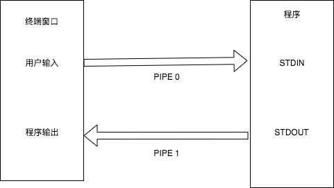

# OJ 入门之输入输出

在刚开始使用 OJ 系统时，会面临输入输出的问题。在 OJ 中做题和平时使用的程序有所不同，下面详细解读一下在 OJ 中的输入输出。

## 基础输入输出

### 原理

在 OJ 的评测环境（Linux）下，每个执行中的程序默认都会有三个流（stream），分别为标准输入流 `stdin`、标准输出流 `stdout`，以及标准错误流 `stderr`。标准错误流一般被用于输出错误信息，此处我们不做介绍。

当我们在本地运行程序时，会出现一个可以获取我们输入、打印程序输出的终端窗口。我们输入到终端窗口的内容会通过标准输入流（以下简称为 `stdin`）传递到程序，而程序输出的内容会通过标准输出流（以下简称为 `stdout`）显示到终端，这之中进行连接的就是管道（`pipe`）。

<p align="center">
    
</p>

在终端中，用户输入的内容与程序输出的内容都会显示在终端窗口内，对初学者会造成很大的困扰。用户可能分辨不出来，自己的程序到底有没有输出回车、与示例输出有什么区别。为此，SDUTOJ 将只有空白字符与答案不同的提交标记为 `Presentation Error`，即“格式错误”，便于用户排查。

而当我们将代码提交到 OJ 平台后，OJ 平台会创建输入与输出的文件，通过流重定向的方式，让程序从文件获取输入，将输出写入文件，此时程序的输入与输出是完全分开的。在本地进行测试时，也可以通过同样的方式来进行自测。

### 示例

#### 只有输出

示例题目：[SDUTOJ 1110](https://acm.sdut.edu.cn/onlinejudge2/index.php/Home/Index/problemdetail/pid/1110.html)。

在这个题目中，我们不需要输入，只需要输出 `Hello World!` 即可。

**C**

```c
#include <stdio.h>
int main() {
    printf("Hello World!\n");
    return 0;
}
```

**C++**

```cpp
#include <iostream>
using namespace std;
int main() {
    cout << "Hello World!" << endl;
    return 0;
}
```

**Python**

```python
print("Hello World!")
```

OJ 系统会获取到我们代码程序的输出，将其与答案文件进行对比（一般是逐字节进行比对）。如果经过对比后，系统认为答案正确，则用户提交的代码将会被判断为正确（`Accepted`）。
